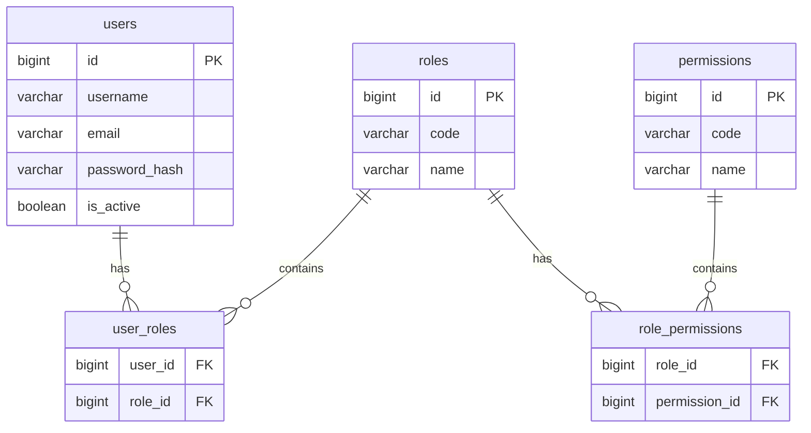

# Auth Service – Database Design (RBAC Model)

ระบบ Auth ใช้รูปแบบ RBAC (Role-Based Access Control) ประกอบด้วย 5 ตารางหลักดังนี้:

- `users`
- `roles`
- `permissions`
- `user_roles`
- `role_permissions`

## 1. ER Diagram Overview



## 2. Database Schema

### 2.1 Table: `users`

```sql
CREATE TABLE users (
  id              BIGSERIAL PRIMARY KEY,
  username        VARCHAR(50)  NOT NULL UNIQUE,
  email           VARCHAR(255) NOT NULL UNIQUE,
  password_hash   VARCHAR(255) NOT NULL,
  first_name      VARCHAR(100),
  last_name       VARCHAR(100),
  is_active       BOOLEAN      NOT NULL DEFAULT TRUE,
  last_login_at   TIMESTAMP,
  created_at      TIMESTAMP    NOT NULL DEFAULT NOW(),
  updated_at      TIMESTAMP    NOT NULL DEFAULT NOW()
);
```

### 2.2 Table: `roles`

```sql
CREATE TABLE roles (
  id              BIGSERIAL PRIMARY KEY,
  code            VARCHAR(50)  NOT NULL UNIQUE,
  name            VARCHAR(100) NOT NULL,
  description     TEXT,
  is_system       BOOLEAN      NOT NULL DEFAULT FALSE,
  created_at      TIMESTAMP    NOT NULL DEFAULT NOW(),
  updated_at      TIMESTAMP    NOT NULL DEFAULT NOW()
);
```

### 2.3 Table: `permissions`

```sql
CREATE TABLE permissions (
  id              BIGSERIAL PRIMARY KEY,
  code            VARCHAR(100) NOT NULL UNIQUE,
  name            VARCHAR(150) NOT NULL,
  description     TEXT,
  module          VARCHAR(100),
  created_at      TIMESTAMP    NOT NULL DEFAULT NOW(),
  updated_at      TIMESTAMP    NOT NULL DEFAULT NOW()
);
```

### 2.4 Table: `user_roles`

```sql
CREATE TABLE user_roles (
  user_id   BIGINT NOT NULL,
  role_id   BIGINT NOT NULL,
  created_at TIMESTAMP NOT NULL DEFAULT NOW(),

  PRIMARY KEY (user_id, role_id),

  CONSTRAINT fk_user_roles_user
    FOREIGN KEY (user_id) REFERENCES users(id)
    ON DELETE CASCADE,

  CONSTRAINT fk_user_roles_role
    FOREIGN KEY (role_id) REFERENCES roles(id)
    ON DELETE CASCADE
);
```

### 2.5 Table: `role_permissions`

```sql
CREATE TABLE role_permissions (
  role_id        BIGINT NOT NULL,
  permission_id  BIGINT NOT NULL,
  created_at     TIMESTAMP NOT NULL DEFAULT NOW(),

  PRIMARY KEY (role_id, permission_id),

  CONSTRAINT fk_role_permissions_role
    FOREIGN KEY (role_id) REFERENCES roles(id)
    ON DELETE CASCADE,

  CONSTRAINT fk_role_permissions_permission
    FOREIGN KEY (permission_id) REFERENCES permissions(id)
    ON DELETE CASCADE
);
```

## 3. Example Initialization Data

### 3.1 Insert Roles

```sql
INSERT INTO roles (code, name, description, is_system)
VALUES
  ('ADMIN', 'Administrator', 'Full access', TRUE),
  ('STAFF', 'Staff', 'Internal staff user', FALSE),
  ('MEMBER', 'Member', 'Normal member', FALSE);
```

### 3.2 Insert Permissions

```sql
INSERT INTO permissions (code, name, module)
VALUES
  ('USER_CREATE', 'Create user', 'USER'),
  ('USER_VIEW',   'View user',   'USER'),
  ('USER_EDIT',   'Edit user',   'USER'),
  ('USER_DELETE', 'Delete user', 'USER');
```

### 3.3 Map Role ↔ Permissions

```sql
-- ADMIN gets all permissions
INSERT INTO role_permissions (role_id, permission_id)
SELECT 1, id FROM permissions;

-- STAFF gets only view + edit
INSERT INTO role_permissions (role_id, permission_id)
SELECT 2, id FROM permissions WHERE code IN ('USER_VIEW', 'USER_EDIT');
```

### 3.4 Map User ↔ Role

```sql
INSERT INTO users (username, email, password_hash)
VALUES ('admin', 'admin@example.com', 'hashed_password')
RETURNING id;

INSERT INTO user_roles (user_id, role_id)
VALUES (1, 1);
```
